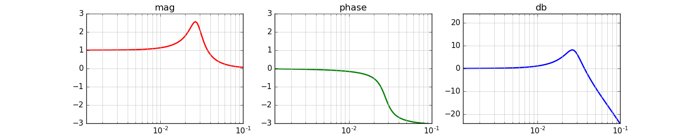

# freqr
[](https://travis-ci.org/mohayonao/freqr)
[](https://www.npmjs.org/package/freqr)
[](https://mohayonao.mit-license.org/)

> Compute the frequency response of a digital filter.

## Installation

```
npm install freqr
```

## Quick Example

```js
const freqr = require("freqr");

// type: "lowpass", freq: 2400hz, Q: 8
const b = [ 0.027136,  0.054272, 0.027136 ];
const a = [ 1.000000, -1.766316, 0.874860 ];

for (let f = 0; f < 0.2; f += 0.0025) {
  const res = freqr(b, a, f);

  console.log(res);
}
```



## API

- `freqr(b, a, f)`
  - `b: number[]` - coefficients of feedforward
  - `a: number[]` - coefficients of feedback
  - `f: number` - normalized frequency [0..1]
    - `f = frequency / sampleRate`
  - returns
    - `mag: number`
    - `phase: number`
    - `db: number`
      - `db = 20 * Math.log(mag) / Math.LN10`

## License

MIT
